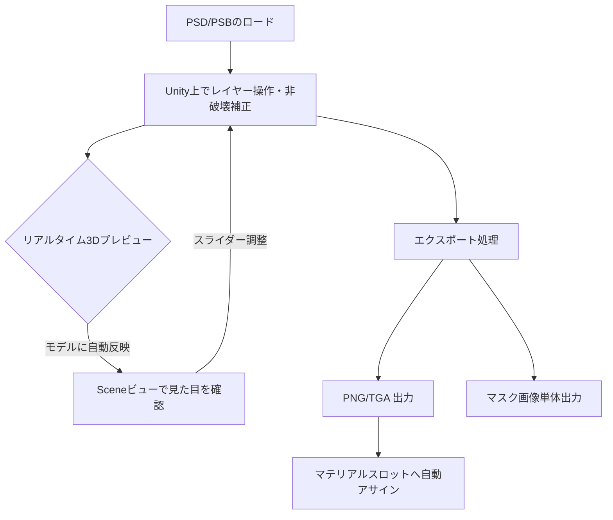

# VRChatアバター・テクスチャ編集用途におけるDennoko PSD Editorの機能評価レポート

本レポートでは、Unityエディタ上で動作するPSD編集ツール「Dennoko PSD Editor」を、**VRChatユーザー向けの3Dモデル（アバター・ワールドオブジェクト）のテクスチャ編集・改変ツール**として活用する場合における機能的な過不足を評価します。

---

## 1. 評価の前提：VRChatにおけるテクスチャ改変のワークフローと要求仕様

VRChatユーザー（特にアバターの改変を行う層）は、購入した3Dアバターのテクスチャを以下のようにカスタマイズ（改変）します。

*   **色改変（カラーバリエーションの作成）**: 髪、瞳、衣装、肌の色調を好みに変更する。
*   **パーツのカスタマイズ**: メイク（チーク、リップ）、タトゥー、衣装の模様などのレイヤーを表示/非表示で切り替える。
*   **特殊マスクテクスチャの作成**: lilToonやPoiyomiなどの高機能トゥーンシェーダーで用いる「Emission（発光）マスク」「MatCap（ハイライト）マスク」「質感マスク（Metallic/Smoothness）」などを生成する。
*   **3D環境での確認**: UnityのSceneビューまたはGameビューで、シェーダー（ライティング、影、リムライトなど）が適用された3Dモデルの見た目を見ながら、テクスチャの色味を微調整する。

これらのユースケースを前提とし、ツールの機能評価を行います。

---

## 2. PSD形式およびファイルの読み込みに関する評価

| 項目 | 本ツールの対応状況 | VRC用途における適合性評価 |
|---|---|---|
| **PSDバージョン** | PSD (V1) のみサポート。 PSB (V2) は非対応。 | **【致命的な不足】** VRChatの人気アバターはテクスチャが超高解像度（4K〜8K）かつレイヤー数が非常に多いため、アセットに含まれるPSDが2GBを超えて**PSB（Photoshop Big）形式**で配布されるケースが一般的です。PSBが読み込めないことは、主要なアバター改変作業において大きな障壁となります。 |
| **カラーモード** | RGB（8bit/16bit）に対応。 CMYK/LABは非対応（マージ表示のみ）。 | **【十分】** 3Dモデルのテクスチャは基本的にすべてRGB（8bitまたは16bit sRGB）であるため、これで完全に十分です。CMYKのサポートは不要です。 |
| **圧縮形式** | Raw, RLE（PackBits）, ZIP圧縮に対応。 | **【十分】** Photoshop or CLIP STUDIO PAINTで保存されるPSDは通常RLEまたはZIPで圧縮されるため、これらを問題なくデコードできます。 |
| **カラープロファイル** | sRGB / Linearの二重変換防止ロジックあり。 | **【十分】** VRCアバターの開発プロジェクトはUnityの「Linearカラースペース」であることが一般的です。本ツールはGPUのsRGB自動変換を通さずバイト値を維持したまま合成を行うため、PhotoshopとUnity上（および書き出しPNG）での色ずれを防ぐ設計になっており、非常に適しています。 |

---

## 3. 対応レイヤーおよび調整機能の評価（十分な点・強み）

VRChatのアバター改変において、本ツールのレイヤー対応状況は非常に強力であり、他の単純なインポートツールと一線を画す強みを持っています。

### ① フォルダ（レイヤーグループ）とクリッピングマスクへの対応
アバターのテクスチャPSDは、「face」「hair」「body」「cloth」などの大グループから、瞳のパーツなどの小グループに細かく分けられており、影やハイライト用のレイヤーがクリッピングマスクとして重ねられています。本ツールは**再帰的なフォルダ構造（PassThroughブレンド含む）**および**クリッピングマスク**に対応しているため、アバターPSDの階層構造を壊さずに再現可能です。

### ② 高機能な非破壊色調補正（調整レイヤー）
単なるレイヤーのON/OFFだけでなく、以下の非破壊補正がUnity上でスライダーを用いて実行可能です。
*   **色相・彩度・明度（HSL）**: 髪や瞳のカラーチェンジの基本機能。
*   **トーンカーブ（Curves）**: 微細なコントラストや色合いの調整に不可欠。
*   **グラデーションマップ（Gradient Map）**: **【極めて重要】** アバターの瞳のグラデーション色変更や、髪の毛にグラデーションカラーを馴染ませる際に多用されます。これをUnity上で非破壊的に試行錯誤できるのは圧倒的な強みです。

### ③ 色域選択マスク（Color Range Mask）によるマスク画像生成
*   スポイトツールでプレビュー画面をクリックするだけで、特定の色範囲（例：服の特定部分、髪の毛など）を抽出したグレースケールマスク画像（PNG）を瞬時にエクスポートできます。
*   これは、lilToon等のトゥーンシェーダーで「特定の箇所だけ発光させる（Emission）」「特定の箇所だけ質感を金属にする（Metallic/MatCap）」といった**カスタムマスク画像をUnity内で自作する作業において、劇的な効率化**をもたらします。

---

## 4. 機能的な「不足している点」（改善課題）

一方で、実用的なVRChatテクスチャ改変ツールとして評価した場合、以下の機能が不足しています。

### ① 3Dモデル（アバター）へのリアルタイム同期プレビューの欠如（最重要）
*   **現状**: 2Dのプレビュー画面（市松模様背景）のみで最終結果を確認する仕様となっています。
*   **問題点**: 3Dアバターのテクスチャは、トゥーンシェーダー（lilToonなど）の「影の乗り方」「MatCap（金属光沢などのハイライト）」「暗所での発光」が適用された3Dの状態で初めて見た目が決定します。2Dプレビューだけで色調整を行っても、実際にアバターに適用すると「暗すぎる」「影と馴染んでいない」といった問題が頻発し、手動で書き出しては確認する往復作業が発生します。
*   **改善案（技術的アプローチ）**: 
    *   **「RenderTexture動的バインディング方式」**の採用を推奨します。
    *   ツール側で複雑なアバター用シェーダーを再実装したりシミュレートしたりする必要は一切ありません。Unityの標準機能を利用し、編集中の一時テクスチャ（RenderTexture）を、対象アバターのマテリアルのプロパティ（例：`_MainTex`や`_MainColorTex`）に `material.SetTexture()` を用いて動的に割り当てます。
    *   これにより、lilToonやPoiyomiなどのトゥーンシェーダー自体が持つ3D陰影・ライティング・MatCap・アウトラインといった描画システムを**そのまま利用**してSceneビュー上に結果をリアルタイム表示させることができます。
    *   **軽量性の担保**: この方式はGPU内のテクスチャポインタを切り替えるだけであるため、ファイル書き出しやアセットデータベースの更新、CPU-GPU間のテクスチャコピーが一切発生せず、極めて高速かつ軽量（オーバーヘッドほぼゼロ）に動作します。
    *   **安全性の担保と異常終了（クラッシュ）対策**:
        *   プレビュー開始時に、「対象マテリアルのGUID」「テクスチャプロパティ名」「元のテクスチャのGUID」のペア情報を **`EditorPrefs`** 等に永続化データ（JSON文字列など）として保存します。
        *   Unity起動時やコンパイル時に自動実行される **`[InitializeOnLoad]`** 属性の静的クラスを用いて、起動時に `EditorPrefs` にプレビュー中データが残っているかをチェックします。
        *   もしデータが残っていれば「前回正常終了されなかった（プレビュー中にクラッシュした）」と判定し、マテリアルのプロパティに元のテクスチャを自動的に再割り当てして復元します。復元後は `EditorPrefs` 内のデータをクリアします。
        *   この仕組みにより、プレビュー中にクラッシュ、タスクキル、停電などでUnityが意図せず終了した場合でも、次回起動時にマテリアルが「Missing」や壊れた状態のままシーンに保存されてしまうリスクを完全に防ぎます。

### ② 書き出しファイルの自動マテリアル適用（Auto-Apply）フローの弱さ
*   **現状**: PNGはプロジェクト内の指定フォルダ（`Assets/PSDSE_exported`）に出力され、その後ユーザーが手動でマテリアルのテクスチャスロットに割り当てる必要があります。
*   **問題点**: 改変作業中は「ちょっと色を変えて書き出し、確認する」という試行錯誤を何十回も繰り返します。都度ドラッグ＆ドロップでアサインし直すのは手間がかかります。
*   **改善案**: 最終エクスポート（PNG/TGA）時に、対象アバターのマテリアルのテクスチャスロットを自動的に新しいPNG/TGAアセットに差し替える（または既存の元テクスチャアセットを直接上書き保存してアセットを自動インポートする）「ワンクリック反映機能」が求められます。

### ③ TGA（Targa）形式書き出しの非対応
*   **現状**: PNGとPSDのみサポート。
*   **問題点**: VRChatアバターのテクスチャでは、圧縮アルゴリズムによる劣化を避けるため、また透過（Alpha）情報をカラーチャンネルと完全に分離して綺麗に保持するために、**TGA形式（.tga）**が非常に好まれます。特に古いアバターや、一部の伝統的なシェーダー設定ではTGAがデファクトスタンダードとなっています。
*   **改善案**: 出力フォーマットの選択肢に「PNG」のほか「TGA（24bit/32bit）」を追加すべきです。

### ④ テキスト/シェイプなどのベクターレイヤーのレンダリング制限
*   **現状**: PSDパーサーが独自実装であるため、Photoshop特有のテキストデータやベクターシェイプ、スマートオブジェクトといった特殊レイヤーは、PSDファイル保存時に書き込まれる「ラスタライズ済みの画像キャッシュ（Pre-rendered pixel data）」が存在しない場合、正しく描画されないかスキップされる可能性があります。
*   *※ただし、PhotoshopやCLIP STUDIO PAINTから「互換性を優先」で保存されたPSDであれば画像キャッシュが含まれるため、基本的には表示されます。*

---

## 5. VRChat特化型ツールに向けた拡張ロードマップ提案

本ツールを「VRChat改変特化型」のキラーアセットにするために、以下の拡張を行うことを推奨します。

### 【短期フェーズ（優先度：高）】
1.  **3Dマテリアルリアルタイムプレビュー (Real-time Material Binding)**:
    *   エディタウィンドウに「プレビュー対象マテリアル（またはRenderer）」の参照フィールドを追加。
    *   PSD編集で `_needsRecomposite = true` が発生した際、合成された一時 `RenderTexture` をそのマテリアルのテクスチャプロパティに一時的にアサインし、3Dモデルにリアルタイム反映する。
2.  **PSB（Photoshop Big）形式のサポート**:
    *   独自パーサーのヘッダー解析部分を修正し、Version 2 (PSB) で用いられる64bit長のアドレス/サイズ指定に対応する。これにより2GB超えの巨大アバターPSDをロード可能にする。

### 【中期フェーズ（優先度：中）】
3.  **TGA書き出し機能**:
    *   Unityの標準APIには `EncodeToTGA` はないが、TGAのバイナリ構造は非常に単純（ヘッダー18バイト＋ピクセルデータ）なため、C#で簡易的なTGAエンコーダーを実装し、32bit（アルファあり）/24bitのTGA書き出しに対応する。
4.  **マスク単体の書き出し機能の強化**:
    *   「色域選択マスク」で生成したマスク画像を、メインテクスチャとは別アセット（例：`[PSD名]_[レイヤー名]_mask.png`）としてワンクリックでエクスポートするUIを整備。

---

## 6. 総評

Dennoko PSD Editorは、**「Unityエディタ内で完結する非破壊テクスチャ調整ツール」としてすでに極めて優れたポテンシャル**を持っています。特に「トーンカーブ」「グラデーションマップ」の非破壊編集や「色域選択マスク（スポイト機能付き）」は、アバターの瞳・衣装改変や、特殊シェーダー用マスクの自作に絶大な威力を発揮します。

しかし、VRChatアバター改変の実際の現場においては、**「PSB形式（2GB超え）の読み込み」**および**「Sceneビュー上の3Dモデルへのリアルタイム同期プレビュー」**の2点が実用上の最大のボトルネックとなります。
この2つの課題がクリアされれば、PhotoshopやCLIP STUDIO PAINTなどの高価・高機能な外部ソフトを使わずとも、Unity内でアバター改変の9割を完結させられる「VRChatユーザー必携の神ツール」へと進化するでしょう。
